<h1>Hi, I'm Ratnesh Pathak 👋</h1>

<strong>AI/ML • Data Analytics • Full-Stack Development • Automation</strong>

   

  

🌟 Highlight Reel

<table>
<tr>
<td align="center">🎓 <strong>SGPA</strong> <strong>9.36</strong></td>
<td align="center">📖 <strong>Research Papers</strong> <strong>3 Published</strong></td>
<td align="center">🏅 <strong>Project Exam Score</strong> <strong>150/150</strong></td>
<td align="center">📚 <strong>Certifications</strong> <strong>110+</strong></td>
<td align="center">🧩 <strong>LeetCode Badges</strong> <strong>23</strong></td>
<td align="center">🚀 <strong>Hackathons</strong> <strong>2× Finalist</strong></td>
<td align="center">💼 <strong>LinkedIn Followers</strong> <strong>12,500+</strong></td>
</tr>
</table>

 

🏛️ <strong>Permanently featured on UG & PG college websites, official banners, and college magazines — recognized as a standout student across both institutions.</strong>

👋 About Me

<table>
<tr>
<td width="62%" valign="top">

┌──────────────────────────────────────────────────────┐
│  $ whoami                                            │
├──────────────────────────────────────────────────────┤
│  name        : Ratnesh Pathak                        │
│  education   : M.Sc. Information Technology          │
│                (9.36 SGPA)                            │
│  role        : AI/ML Intern @ Alvin IT Solutions     │
│  focus       : AI • Machine Learning • Data Analytics│
│  building    : Practical, verifiable AI/software     │
│  practicing  : Python • SQL • Power BI • CV          │
│  exploring   : AI Agents • APIs • NLP                │
│  mindset     : Learn → Build → Share → Improve      │
└──────────────────────────────────────────────────────┘

</td>
<td width="38%" align="center" valign="middle">

</td>
</tr>
</table>

I'm an M.Sc. IT graduate (9.36 SGPA, batch topper) currently working as an AI/ML Intern at Alvin IT Solutions, based in Mumbai. My work sits at the intersection of applied machine learning, data analytics, NLP, and full-stack development — I like taking a problem from research and idea to a working prototype.

I've published 3 research papers (including financial sentiment analysis with NLP), scored 150/150 on my final research project exam, and been permanently featured on my UG and PG college's official websites, banners, and magazines as a recognized top student. Alongside that, I stay active on LeetCode, take on freelance/client work, and stay close to Mumbai's tech ecosystem through events and community involvement.

🤖 AI / ML & Data Focus

Areas I actively work in: Machine Learning, Computer Vision, NLP & Sentiment Analysis, Data Analytics & Dashboards, and AI-Assisted Prototyping — turning ideas into working software, then improving reliability, testing, and deployment.

---

## 🚀 Featured Projects

### 💹 FinSentAI — Financial Intelligence Platform

End-to-end financial intelligence platform combining NLP, machine learning, financial news, market data, and actionable signal generation.

✨ **Highlights**

🧠 TF-IDF + SVM sentiment classification, VADER + ensemble prediction

📰 Financial news ingestion + live market data integration

📶 BUY / SELL / HOLD / WATCH / CAUTION signal engine

🔐 REST API with API-key auth, user auth & role-based features

📊 Watchlists, alerts, analytics dashboards, AI assistant, report builder

🐳 Docker + Gunicorn deployment, Pytest suite, GitHub Actions CI

🛠️ **Stack:** Python · Flask · scikit-learn · NLP · VADER · JavaScript · REST API · Docker · Pytest

🔒 Private Repository · **[View Repository](https://github.com/RatneshPathak/FinSentAI)** · 🌐 **[View Live Demo](https://finsentai.onrender.com/)**

---

### 🛡️ ContractGuard Pro — AI Contract Intelligence Platform

Full-stack AI-powered contract analysis platform for reviewing contracts, flagging risk, explaining clauses, generating redlines, and chatting with an AI assistant about contracts.

✨ **Highlights**

🤖 AI-powered contract analysis with Groq LLMs

📄 PDF and DOCX contract extraction

⚠️ Automated risk and clause analysis, redline generation, summaries

🔒 Helmet security headers, API rate limiting, strict CORS validation

🌱 Environment-based API key management and feature-branch Git workflow

🛠️ **Stack:** React · Vite · Node.js · Express · Groq AI · PDF/DOCX Processing · REST API

🔒 Private Repository · **[View Repository](https://github.com/RatneshPathak/ContractGuard-Pro)**

---
### ✈️ WanderLust — AI-Powered Travel Super App

Full-stack AI-powered travel platform combining intelligent trip planning, travel utilities, authentication, dashboards, budget management, booking workflows, and smart travel assistance.

✨ **Highlights**

🔐 Authentication, trip creation & management and admin panel

💰 Budget management, activity management and analytics

🌦️ Weather, ✈️ flight, 📍 geocoding and 💱 currency integrations

🤝 Shared-trip functionality and AI-powered travel features

🧳 Smart packing and practical travel utilities

🧠 AI-powered travel planning and assistance

🛠️ **Stack:** Python · Flask · JavaScript · REST API · PostgreSQL · Vercel

🔒 Private Repository · **[View Repository](https://github.com/RatneshPathak/WanderLust)** · 🌐 **[View Live Demo](https://wander-lust-beta-eight.vercel.app/)**

---

### 📚 E-Book Management System — Full Stack Web Application

Full-stack e-book platform built with Java, JSP, JavaScript and MySQL, featuring authentication, administration, purchasing, payments, inventory and search workflows.

✨ **Highlights**

🔐 User authentication and role-based access

👨‍💼 Admin dashboard and inventory management

📚 E-book selling, purchasing and search functionality

💳 Payment module and transaction workflows

🗄️ MySQL database integration

🖥️ Complete web application UI

🛠️ **Stack:** Java · JSP · JavaScript · HTML5 · CSS3 · MySQL · Maven

🔒 Private Repository · **[View Repository](https://github.com/RatneshPathak/eBook-Management-System)**

---

### 🤖 RPA Automation — Automated Data Entry System

Automated Robotic Process Automation system that eliminates repetitive manual data entry by combining a custom web interface, Excel-based data processing, and UiPath workflows.

✨ **Highlights**

🔁 End-to-end automated data-entry pipeline

🖥️ Custom web interface for data visualization and management

⚙️ UiPath workflows reading Excel data and dynamically populating web forms

🛡️ Error-handling mechanisms for reliable, consistent runs

✅ 100% data-entry accuracy in the demonstrated workflow

🛠️ **Stack:** UiPath Studio · Python · HTML5 · CSS3 · Excel · Google Forms

🔒 Private Repository · **[View Repository](https://github.com/RatneshPathak/rpa-automated-data-entry)**

---

### 🎬 Netflix Homepage — Frontend UI Project

Netflix-inspired homepage project demonstrating frontend development, entertainment-focused UI design, content presentation and modern web deployment.

✨ **Highlights**

🎥 Netflix-inspired landing page

🔥 Popular and trending entertainment sections

💳 Subscription plan presentation

❓ FAQ section

🎨 Entertainment-focused UI

☁️ Deployed with Vercel

🛠️ **Stack:** HTML5 · CSS3 · JavaScript · Vercel

🔒 Private Repository · **[View Repository](https://github.com/RatneshPathak/NetflixHomePage)** · 🌐 **[View Live Demo](https://ratneshnetflixhomepage.vercel.app/)**

---

### 🛡️ crowd_safety_ai

Real-time crowd risk detection using computer vision to analyze crowd density and motion anomalies for public safety.

🛠️ **Stack:** Python · Computer Vision

🌐 Public Repository · **[View Repository](https://github.com/RatneshPathak/crowd_safety_ai)**

---

### 📊 Power-BI-dashboard

Data analytics dashboard project focused on transforming data into interactive business insights.

🛠️ **Stack:** Power BI

🌐 Public Repository · **[View Repository](https://github.com/RatneshPathak/Power-BI-dashboard)**

---
### 📓 IIT-BOMBAY-

Notebook-based project and learning work.

🛠️ **Stack:** Jupyter Notebook

🌐 Public Repository · **[View Repository](https://github.com/RatneshPathak/IIT-BOMBAY-)**

---

### 🐍 Python-Practice

Applied Python problem-solving and programming practice.

🛠️ **Stack:** Python

🌐 Public Repository · **[View Repository](https://github.com/RatneshPathak/Python-Practice)**

---

## 🛠️ Tech Stack

### Languages

### AI / ML & Data

### Web / Tools

---

## 🧩 Problem Solving

23 LeetCode Badges — consistent coding practice alongside academic and project work.

---

## 🏅 Achievements

### 🎓 Academic

M.Sc. IT — 9.36 SGPA · 150/150 in Final Research Project Exam · 3 published research papers

### 🏛️ Recognition

Permanently featured on UG & PG college websites, official banners, and college magazines

### 🏆 Competitions

3 national-level · 3 state-level · 60+ inter-collegiate wins · 20 individual trophies · 20+ medals

### 🚀 Hackathons

2× Finalist

### 💼 Professional

Best Student of Batch — JP Morgan × Anudip Foundation (Gold Milestone) · 110+ certifications

### 🌐 Community & Leadership

Student Council Member · Documentation Head · Event Organizer · Head Core (Freshers & Farewell) · Student Coordinator, ONGC-NIO · Contingent Leader, CC Phoenix

---

## 💼 Freelance & Client Projects

I don't only build academic projects — I've helped juniors, college colleagues, and outside clients turn requirements into working solutions: web/app development, Google Forms, presentations, project documentation, and technical mentorship, alongside freelance work through Fiverr.

---

## 🌍 Beyond the Code

200+ technology events attended across Mumbai — talks, workshops, hackathons, and community meetups. I try to stay close to the ecosystem, not just the screen.

---

## 📊 GitHub Activity

### 🏆 GitHub Trophies

### 🐍 Contribution Snake

<!--START_SECTION:contribution-snake-->

<!--END_SECTION:contribution-snake-->

---

## 📫 Connect With Me

   

 

🚀 **"Learn. Build. Share. Improve. Repeat."**

Open to AI/ML opportunities, collaborations, and interesting problems.

